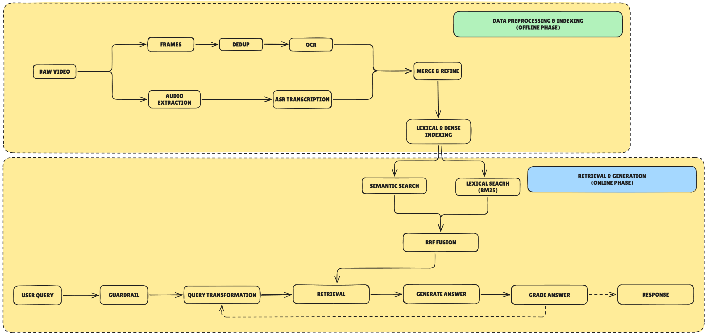

# Temporal Video RAG & Agentic QA System
> **Course Project:** CS431 - Deep Learning Techniques and Applications  
> **Topic:** Intelligent Temporal-Grounded Video Lecture Q&A System via Agentic Self-RAG Architecture

[](https://github.com/duylw/temporal-rag-qa-system/actions/workflows/ci.yaml)
[](https://youtu.be/9oUEUA-QYAI)


---

## 1. Team Members

| No. | Full Name            | Student ID | GitHub                                     |
| :---:| :---------------------| :----------:| :-------------------------------------------|
| 1   | **Lương Quang Duy**  | 23520368   | [@duylw](https://github.com/duylw)         |
| 2   | **Nguyễn Bá Long**   | 23520880   | [@NBasLongz](https://github.com/NBasLongz) |
| 3   | **Dương Thái Ý Nhi** | 23521106   | [@dtynhi](https://github.com/dtynhi)       |

---

## 2. Executive Summary

This project delivers a production-grade multimodal Question & Answering (Q&A) system engineered to solve the challenge of information retrieval and precise timestamp localization across long-form academic video lectures.

The system is built upon an **Agentic Self-RAG** workflow powered by **LangGraph**, combining **Hybrid Retrieval (Dense Semantic Embeddings + Sparse BM25 via Reciprocal Rank Fusion)**, **Temporal Grounding & Chunk Stitching** (merging adjacent video intervals into coherent lecture segments), **Langfuse LLMOps Observability**, and an extensible **Multi-Provider LLM Engine** supporting Google Gemini 3.5, Google Gemma 4, Groq LPU, OpenRouter, and OpenAI.

### Key Engineering Highlights:
- **Agentic LangGraph Workflow**: State machine with automated query guardrailing, retrieval, self-evaluation loop (Answer Grading), and iterative query rewriting with guided feedback.
- **Temporal Grounding & Video Synchronization**: Automatically consolidates contiguous video chunks into clean time intervals (`MM:SS - MM:SS`) and dynamically seeks the embedded video player to exact lecture moments.
- **Hybrid Retrieval with RRF**: Fuses high-density vector representations (`gemini-embedding-2-preview` on ChromaDB) and lexical search (`Rank-BM25`) using Reciprocal Rank Fusion without requiring dedicated GPU infrastructure.
- **Unified Multi-Provider LLM Engine**: Native support for Google Gemini (3.5 Flash Lite, 3.5 Flash, Gemma 4 26B/31B), Groq Cloud (Llama 3.3 70B, DeepSeek R1 Distill), OpenRouter, and OpenAI GPT-4o with automated graceful fallback handling.
- **Full-Stack LLMOps Tracing & Observability**: Integrated with Langfuse OpenTelemetry callbacks to monitor execution graphs, latency breakdown across individual nodes, token consumption, and cost tracking.
- **Microservice Architecture**: Fully containerized backend (FastAPI, asyncpg, SQLAlchemy 2.0) and frontend (Gradio 6) communicating over asynchronous REST interfaces.
- **Automated CI/CD & Testing**: Comprehensive unit and integration test suite (Pytest + Asyncio) integrated into a GitHub Actions CI pipeline with 100% deterministic test execution via mocking.

---

## 3. Video Demonstration

A complete end-to-end demonstration of the system—showcasing real-time query answering, dynamic timestamp seeking, LangGraph Self-RAG reflection loops, and Langfuse tracing—is available on YouTube:

<div align="center">
  <a href="https://youtu.be/9oUEUA-QYAI" target="_blank">
    
  </a>
  <p><em>Click the banner above or visit <a href="https://youtu.be/9oUEUA-QYAI">https://youtu.be/9oUEUA-QYAI</a> to watch the full system demonstration.</em></p>
</div>

---

## 4. System Architecture & Engineering Scope

### 4.1 End-to-End RAG Architecture (Offline vs. Online Pipelines)

The overarching RAG design comprises two distinct lifecycles:
1. **Offline Phase (Data Ingestion & Indexing)**: Multimodal processing of raw video lectures. Visual slide frames are extracted, deduplicated, and passed through OCR, while audio streams are transcribed via ASR. The resulting structured transcripts and slide contexts are merged into temporal lecture chunks and indexed into dual storage engines: **ChromaDB** (Dense Vector Embeddings) and **Rank-BM25** (Sparse Inverted Index).
2. **Online Phase (Real-Time Agentic Inference — Core Implementation of this Repository)**: The live production service executing the interactive LangGraph state machine. It handles student queries, runs safety guardrails, executes adaptive query rewriting, coordinates hybrid RRF retrieval, synthesizes answers with contiguous temporal boundary merging, and performs pure LLM Self-RAG answer validation.

<!-- End-to-End RAG Pipeline Diagram -->
<div align="center">
  
</div>

---

### 4.2 Software & Microservices Architecture (Online Deployment)

The online inference system is architected as an asynchronous, decoupled microservices topology:

```
                      [ User / Gradio Web Client ]
                                   │
                                   ▼ (HTTP / JWT Bearer Auth)
┌─────────────────────────────────────────────────────────────────────────────┐
│                      FastAPI Backend Service Gateway                        │
│                                                                             │
│   ┌────────────────────────┐         ┌──────────────────────────────────┐   │
│   │ API Controllers & Auth │ ──────> │  LangGraph Agentic Orchestrator  │   │
│   │ (Rate Limit, Security) │         │  (Self-RAG State Machine & LLMs) │   │
│   └────────────────────────┘         └──────────────┬───────────────────┘   │
└─────────────────────────────────────────────────────┼───────────────────────┘
                                                      │
                    ┌─────────────────────────────────┴─────────────────┐
                    │ (Persistence Operations)                          │ (Async Tracing)
                    ▼                                                   ▼
        ┌───────────────────────┐                           ┌────────────────────────┐
        │   Persistence Layer   │                           │  Langfuse LLMOps Cloud │
        │  • ChromaDB (Vectors) │                           │  • Real-time Tracing   │
        │  • PostgreSQL (Users) │                           │  • Token & Cost Logs   │
        └───────────────────────┘                           └────────────────────────┘
```

<!-- Software System Architecture Diagram Placeholder -->
<!--
<div align="center">
  
</div>
-->

---

## 5. Technology Stack

| Layer / Component               | Technologies                                       | Purpose                                                        |
| :--------------------------------| :---------------------------------------------------| :---------------------------------------------------------------|
| **API & Backend Framework**     | FastAPI, Uvicorn, Pydantic v2                      | High-throughput asynchronous REST API services                 |
| **Database & ORM**              | PostgreSQL 16, SQLAlchemy 2.0 (Async), Alembic     | Relational data persistence, user management, chunk catalog    |
| **Agent & Graph Orchestration** | LangGraph, LangChain, Rank-BM25                    | State-machine based Self-RAG and hybrid search orchestration   |
| **Vector Storage**              | ChromaDB                                           | High-performance embedding index for dense similarity search   |
| **LLM & Embeddings**            | Google Gemini 3.5, Gemma 4, Groq LPU, OpenRouter   | Text generation, query rewriting, guardrails, self-grading     |
| **Frontend Client**             | Gradio 6, HTML5 Video Player                       | Interactive web dashboard with dynamic video timestamp seeking |
| **Observability & Tracing**     | Langfuse OpenTelemetry                             | Latency tracking, token consumption monitoring, LLM tracing    |
| **Security & Protection**       | PyJWT, Passlib (bcrypt), SlowAPI                   | Authentication, password hashing, and API DDoS rate limiting   |
| **Testing & CI/CD**             | Pytest, Pytest-Asyncio, Pytest-Cov, GitHub Actions | Automated unit/integration test execution and coverage reports |
| **Containerization**            | Docker, Docker Compose, Astral UV                  | Production-ready multi-service container orchestration         |

---

## 6. Project Directory Structure

```text
temporal-rag-qa-system/
├── .github/
│   └── workflows/
│       └── ci.yaml             # Automated GitHub Actions CI pipeline
├── data/                       # Lecture transcripts, metadata, and knowledge base
├── public/                     # Static Web Dashboard (/dashboard)
│   └── index.html
├── gradio_app.py               # Standalone Gradio client entrypoint
├── main.py                     # FastAPI production server entrypoint
├── src/
│   ├── core/                   # Security, JWT tokens, config schemas, rate limiter, logging
│   ├── domain/                 # Domain Entities, Ports interfaces & Exceptions
│   ├── application/            # Agent Orchestrator, ContextManager, Use Cases & DTOs
│   ├── infrastructure/         # Postgres Repositories, ChromaDB, BM25, Multi-LLM Gateway
│   ├── presentation/           # REST API v1 routes (/api/v1/*), Middlewares, DI container
│   └── gradio_ui/              # Standalone Gradio Client (components, handlers, video utils)
├── tests/
│   ├── conftest.py             # Global test fixtures and deterministic mock environments
│   ├── unit/                   # Unit tests (domain, application, infrastructure)
│   └── integration/            # Integration tests (FastAPI v1 endpoints, Gradio client)
├── compose.yaml                # Multi-container Docker Compose (Backend, DB, Chroma, Adminer)
├── Dockerfile                  # Multi-stage production container build specification
├── pyproject.toml              # Project dependencies and tool configurations (Astral UV)
└── README.md
```

---

## 7. Data Confidentiality Statement

> **Notice Regarding Dataset Assets:**
> The original high-resolution lecture video files (`.mp4`) are proprietary course materials and are **kept confidential (omitted from this public repository)**.
>
> **Autonomous Functionality:**
> All associated lecture transcripts, structural metadata, temporal segment boundaries, ChromaDB vector embeddings, and PostgreSQL seed schemas are pre-computed and packaged within the automated initialization pipeline. Consequently, **evaluators and recruiters can build, launch, and test 100% of the Agentic RAG workflow, API endpoints, and UI features without needing local raw video files**.

---

## 8. Installation & Quickstart Guide

### 8.1 Prerequisites
- **Docker** and **Docker Compose** (Recommended for seamless containerized execution).
- Alternatively, **Python 3.12+** and **Astral UV** package manager for local development.

### 8.2 Environment Configuration
Copy the environment template and provide the required API credentials:
```bash
cp .env.example .env
```
Key configuration parameters in `.env`:
```env
# LLM Provider API Keys (Google Gemini is primary)
GOOGLE_API_KEY=your_google_gemini_api_key
GROQ_API_KEY=your_groq_api_key          # (Optional) Ultra-fast Llama 3.3 / DeepSeek R1
OPENROUTER_API_KEY=your_openrouter_key  # (Optional) DeepSeek R1 Full / Qwen 2.5
OPENAI_API_KEY=your_openai_api_key      # (Optional) GPT-4o / GPT-4o Mini

# Langfuse LLMOps Observability & Tracing
LANGFUSE_SECRET_KEY=sk-lf-...
LANGFUSE_PUBLIC_KEY=pk-lf-...
LANGFUSE_BASE_URL=https://cloud.langfuse.com

# Security & Vector Storage
SECRET_KEY=your_secure_jwt_secret_key
CHROMA_HOST=chromadb
CHROMA_PORT=8000
EMBEDDING_MODEL=gemini-embedding-2-preview
```

### 8.3 Launch Backend Services via Docker Compose
Deploy Backend API, PostgreSQL, ChromaDB, and Adminer in detached mode:
```bash
docker compose up -d --build
```

Once started, access the backend services:
- **Web Dashboard**: `http://localhost:8000/dashboard`
- **FastAPI Interactive Docs (Swagger)**: `http://localhost:8000/docs`
- **ChromaDB Vector Store API**: `http://localhost:8008`
- **PostgreSQL Adminer Dashboard**: `http://localhost:8081`

### 8.4 Launch Standalone Gradio Client (Optional)
To run the Gradio interface locally connecting to the Docker Backend:
```bash
# 1. Sync dependencies including Gradio UI group
uv sync --all-groups

# 2. Start Gradio client
uv run --group gradio python gradio_app.py
```
Access Gradio at `http://localhost:7860`.

---

## 9. Automated Testing & CI Pipeline

The project enforces strict software engineering standards with isolated, deterministic unit and integration test coverage. All external LLM calls are mocked during testing to avoid API quota consumption.

Continuous integration is managed automatically via **GitHub Actions**. Real-time execution logs and test reports can be monitored at the [GitHub Actions CI Pipeline](https://github.com/duylw/temporal-rag-qa-system/actions/workflows/ci.yaml).

Execute the Pytest test suite with code coverage analysis locally:
```bash
uv run pytest --cov=src --cov-report=term-missing
```

### Test Suite Execution Output:
```text
======================= 59 passed in 19.19s ========================
- Domain Unit Tests: 100% PASSED (Entities, Invariants, Exceptions)
- Infrastructure Tests: 100% PASSED (LLM Gateway, Repositories, Database)
- Application Tests: 100% PASSED (Agent Orchestrator, ContextManager Stitching, Use Cases)
- Integration Tests: 100% PASSED (REST API v1 Endpoints, Gradio Client)
```

---

## 10. Academic Affiliation & License
This project was developed for academic and research purposes as part of the course **CS431 - Deep Learning Techniques and Applications** at the University of Information Technology (UIT - VNU-HCM).